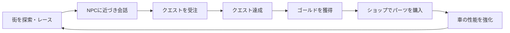
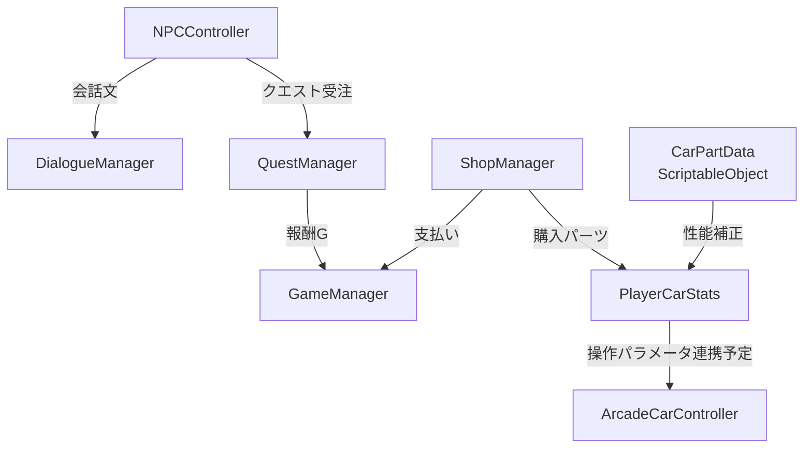

# CarRace_game


チョロQ HG2のような、カジュアルな操作感とRPG的な成長要素を組み合わせたUnity製レーシングRPGです。
街を走ってNPCと会話し、クエストでゴールド（G）を獲得。ショップで車のパーツを購入・装備して、より速いマシンへ育てます。

## ゲームループ



## 実装済み機能

| 機能 | 概要 |
| --- | --- |
| アーケード車両操作 | Rigidbodyベースの加速・後退・旋回・最高速度制限。低重心化で横転しにくい操作感を実装。 |
| NPC会話 | Trigger範囲内でEキーを押すと会話を開始し、Eキーで文章を送るUI制御。 |
| 車パーツ | Engine / Tire / Chassis をScriptableObjectで定義し、性能補正を管理。 |
| 車両ステータス | 基本性能と装備パーツの補正を合算し、最高速度・加速度・旋回性能を算出。 |
| クエスト | クエストの受注・達成・報酬受け取りを管理。 |
| 所持金・ショップ | ゴールドの増減、残高確認、購入済みパーツのインベントリ登録。 |

## システム構成



## 使用技術

- Unity 2022.3 LTS（macOS Apple silicon対応版を推奨）
- C# / UnityEngine
- Rigidbodyによる3D物理演算
- uGUI（`Text` と `Panel`）
- ScriptableObjectによるパーツデータ定義
- Singletonパターンによるゲーム進行管理
- Git / GitHub、Conventional Commits

## 主なスクリプト

```text
Assets/
├── Images/
│   └── readme-racing-rpg-banner.jpg
└── Scripts/
    ├── Vehicle/ArcadeCarController.cs    # 車両操作
    ├── NPC/NPCController.cs              # NPC接近・会話開始
    ├── Dialogue/DialogueManager.cs       # 会話UI
    ├── CarParts/
    │   ├── CarPartData.cs                # パーツ定義
    │   └── PlayerCarStats.cs             # 装備・所持パーツ・性能計算
    ├── Game/GameManager.cs               # 状態・所持金
    ├── Quest/QuestManager.cs             # クエスト・報酬
    └── Shop/ShopManager.cs               # パーツ購入
```

## 動作確認の準備

このリポジトリには現在、ゲームロジックのスクリプトを配置しています。Unity Editorを導入後、次の手順でテストシーンを作成できます。

1. Unity Hubで **Unity 2022.3 LTS（macOS ARM64）** をインストールする。
2. **3D Core** テンプレートでUnityプロジェクトを作成し、`Assets/Scripts` をプロジェクトへ配置する。
3. PlayerCarに `Rigidbody`、`ArcadeCarController`、`PlayerCarStats` を追加し、Tagを `Player` に設定する。
4. GameManager、QuestManager、ShopManager、DialogueManagerをそれぞれ空のGameObjectへ追加する。
5. Canvas配下に会話用PanelとTextを作成し、DialogueManagerのInspectorへ割り当てる。
6. NPCへ `SphereCollider` と `NPCController` を追加する。SphereColliderは会話範囲として使用される。

> 現在の入力処理は旧Input Managerの `Input.GetAxis` / `Input.GetKeyDown` を使用しています。Unityの **Project Settings > Player > Active Input Handling** は `Input Manager (Old)` または `Both` に設定してください。

## 操作

| 操作 | キー |
| --- | --- |
| 前進・後退 | W / S または ↑ / ↓ |
| 旋回 | A / D または ← / → |
| NPCに話しかける・会話を送る | E |

## 今後の拡張候補

- クエスト達成条件の実ゲームイベント連携
- ショップUIとゴールドUIの実装
- 購入済みパーツの装備画面
- `PlayerCarStats` の最終ステータスを `ArcadeCarController` へ反映
- セーブ／ロード機能
